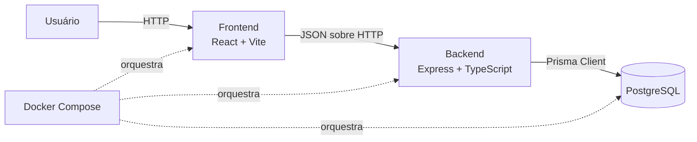

# Arquitetura

## Visão geral

O TecPel Gestão é um monorepo TypeScript gerenciado por pnpm. Ele separa a aplicação web, a API HTTP e a persistência relacional. O backend possui autenticação modular; os demais módulos de negócio ainda serão implementados.



## Componentes atuais

### Frontend

O diretório `frontend/` contém a SPA em React, compilada pelo Vite. React Router controla as rotas públicas e protegidas. TanStack Query mantém `/auth/me` como fonte de verdade da sessão; login e logout atualizam o mesmo cache. A camada `services/` centraliza chamadas HTTP com `credentials: 'include'`. Tailwind CSS sustenta a camada visual. O frontend não lê o JWT, não acessa o banco e não persiste o token localmente.

### Backend

O diretório `backend/` contém a API Express. `src/app.ts` compõe middlewares, rotas, dependências e tratamento centralizado de erros; `src/server.ts` inicia o servidor; `src/config/` valida configurações de ambiente com Zod. Os módulos `src/modules/auth/`, `products/` e `stock/` separam HTTP, casos de uso e contratos de persistência. Implementações Prisma não ficam nos controllers.

### Banco de dados

PostgreSQL é o banco relacional e Prisma é o ponto de acesso da aplicação. O schema contém usuários, produtos e movimentações rastreáveis de estoque; alterações são versionadas por migrations. Preços e custos usam `Decimal(10,2)` e são expostos na API como strings decimais, evitando representação monetária por ponto flutuante.

### Docker

O Docker Compose organiza três serviços: `frontend`, `backend` e `postgres`. Health checks controlam a prontidão e volumes preservam os dados locais do PostgreSQL e permitem atualização do código durante o desenvolvimento.

### Imagens de produtos

Uploads JPEG, PNG e WebP de até 5 MB são validados por MIME e assinatura do arquivo. O backend gera nomes UUID, salva em `backend/uploads/products/`, serve `/uploads/products` estaticamente e persiste somente `imageUrl`. Substituir uma imagem atualiza a referência; a remoção automática do arquivo anterior foi adiada para evitar acoplar compensações de arquivo e banco nesta milestone.

## Fluxo HTTP

1. O navegador carrega a aplicação React.
2. O frontend envia requisições HTTP para a API configurada em `VITE_API_URL`.
3. O Express recebe a requisição, aplica os middlewares e encaminha para a rota adequada.
4. Regras de aplicação são executadas em serviços ou casos de uso.
5. O acesso aos dados ocorre por implementações de persistência baseadas no Prisma.
6. A API devolve uma resposta JSON e o frontend atualiza a interface.

## Organização das pastas

```text
tecpel-gestao/
├── backend/
│   ├── prisma/          # schema, migrations e seed
│   ├── src/             # API e configuração
│   └── tests/           # testes automatizados do backend
├── frontend/
│   └── src/             # aplicação React, páginas, componentes e utilitários
├── docs/
│   └── adr/             # documentação e registros de decisão
├── .codex/              # contexto e guias para desenvolvimento assistido
└── .github/             # CI, templates e propriedade do código
```

## Responsabilidades das camadas futuras

- **Apresentação:** páginas e componentes; exibe estado e coleta interação.
- **Cliente da API:** centraliza chamadas HTTP, contratos e tratamento técnico de respostas.
- **HTTP:** rotas, controllers, validação de entrada e códigos de resposta.
- **Aplicação:** coordena casos de uso sem depender de Express ou da interface.
- **Domínio:** concentra entidades e regras de negócio validadas.
- **Infraestrutura:** implementa persistência, Prisma e integrações externas.

As camadas devem ser criadas incrementalmente quando houver necessidade real, conforme o [ADR 0002](adr/0002-project-structure.md).

## Autenticação

O login usa `username` e senha verificada com bcrypt (cost factor 12). A API emite JWT com apenas o identificador no `sub`, expiração inicial de 8 horas e armazenamento exclusivo em cookie HttpOnly. O middleware valida token, existência e estado ativo do usuário em cada acesso protegido. Não há refresh token ou blacklist nesta fase. Consulte o [ADR 0003](adr/0003-auth-strategy.md).

No navegador, o acesso a `/dashboard` aguarda a restauração da sessão antes de decidir qualquer redirecionamento. Uma resposta 401 em `/auth/me` representa ausência de sessão e leva a `/login`; uma sessão válida impede permanência no login. O logout limpa a query `['auth', 'session']` mesmo quando a sessão remota já expirou.
