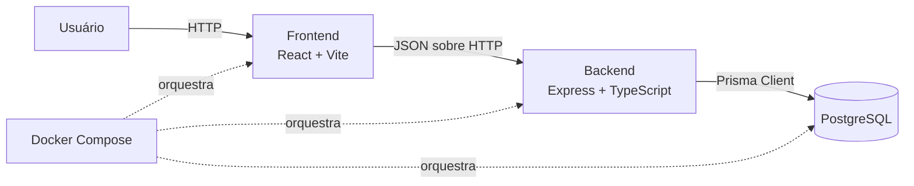

# Arquitetura

## Visão geral

O TecPel Gestão é um monorepo TypeScript gerenciado por pnpm. Ele separa a aplicação web, a API HTTP e a persistência relacional. A implementação atual contém a fundação técnica e ainda não possui modelos ou regras de negócio.



## Componentes atuais

### Frontend

O diretório `frontend/` contém a SPA em React, compilada pelo Vite. React Router controla a navegação e TanStack Query está configurado para o futuro consumo da API. Tailwind CSS e shadcn/ui sustentam a camada visual. O frontend não acessa o banco diretamente.

### Backend

O diretório `backend/` contém a API Express. `src/app.ts` configura middlewares, a rota de saúde e a resposta para rotas inexistentes; `src/server.ts` inicia o servidor; `src/config/` valida configurações de ambiente com Zod. Regras de negócio futuras devem permanecer independentes do transporte HTTP.

### Banco de dados

PostgreSQL é o banco relacional. O Prisma será o único ponto de acesso da aplicação ao banco. O schema está configurado, mas ainda não contém modelos de negócio. Toda alteração futura de schema deve ser versionada por migrations.

### Docker

O Docker Compose organiza três serviços: `frontend`, `backend` e `postgres`. Health checks controlam a prontidão e volumes preservam os dados locais do PostgreSQL e permitem atualização do código durante o desenvolvimento.

## Fluxo HTTP

1. O navegador carrega a aplicação React.
2. O frontend envia requisições HTTP para a API configurada em `VITE_API_URL`.
3. O Express recebe a requisição, aplica os middlewares e encaminha para a rota adequada.
4. Futuras regras de negócio serão executadas em serviços ou casos de uso.
5. O acesso aos dados ocorrerá por repositórios baseados no Prisma.
6. A API devolve uma resposta JSON e o frontend atualiza a interface.

## Organização das pastas

```text
tecpel-gestao/
├── backend/
│   ├── prisma/          # schema, migrations e seed
│   ├── src/             # API e configuração
│   └── tests/           # testes automatizados do backend
├── frontend/
│   └── src/             # aplicação React, páginas, componentes e utilitários
├── docs/
│   └── adr/             # documentação e registros de decisão
├── .codex/              # contexto e guias para desenvolvimento assistido
└── .github/             # CI, templates e propriedade do código
```

## Responsabilidades das camadas futuras

- **Apresentação:** páginas e componentes; exibe estado e coleta interação.
- **Cliente da API:** centraliza chamadas HTTP, contratos e tratamento técnico de respostas.
- **HTTP:** rotas, controllers, validação de entrada e códigos de resposta.
- **Aplicação:** coordena casos de uso sem depender de Express ou da interface.
- **Domínio:** concentra entidades e regras de negócio validadas.
- **Infraestrutura:** implementa persistência, Prisma e integrações externas.

As camadas devem ser criadas incrementalmente quando houver necessidade real, conforme o [ADR 0002](adr/0002-project-structure.md).
